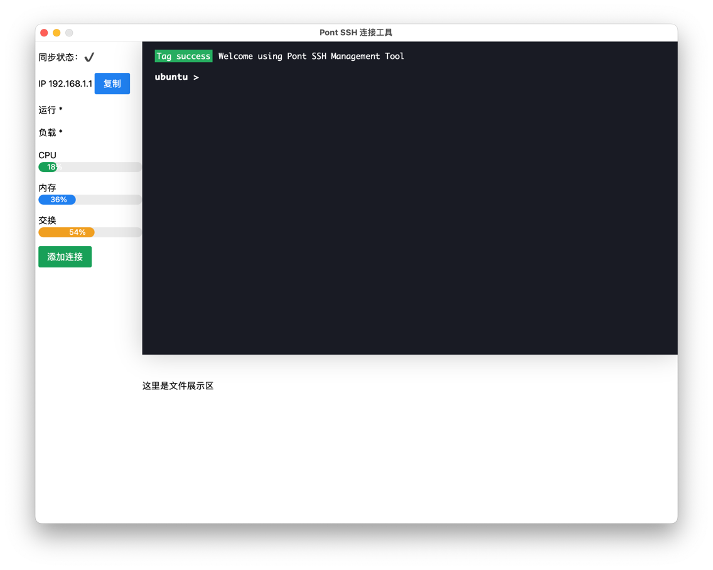

# Pont SSH 连接工具

## 项目介绍

本项目基于 Golang 语言，Wails 框架，Vue.js 开发的一款跨平台、轻量级 SSH 连接客户端。

## 功能模块

- [x] 连接管理
- [ ] 日志管理
- [ ] 系统设置
- [ ] 帮助文档
- [ ] 关于作者
- [ ] 参与贡献
- [x] Github

## 备注

项目目前还在开发阶段，仓库内信息会不断更新，敬请期待。